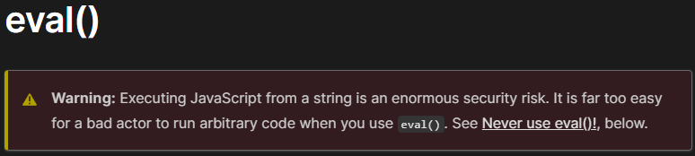

# Building against stupid build targets

> Auth0 edition

---

## <rant>

---


<!-- _class: top-aligned -->
## Module systems

---

<!-- _class: top-aligned -->

## Why have just 1?

---

<!-- _class: top-aligned -->

## When you can have 2

- ECMAScript modules
- CommonJS

---

<!-- _class: top-aligned -->

## When you can have ~~2~~ 3!

- ECMAScript modules
- CommonJS
- AMD

---

<!-- _class: top-aligned -->

## When you can have ~~2~~ ~~3~~ 4!!

- ECMAScript modules
- CommonJS
- AMD
- SystemJS

---

<!-- _class: top-aligned -->

## When you can have ~~2~~ ~~3~~ ~~4~~ _5_!!!

- ECMAScript modules
- CommonJS
- AMD
- SystemJS
- UMD

---


---

## </rant>

---
## ECMAScript modules (screw the rest)

---

## Source

```javascript
// add.js

export function add(x, y) {
  return x + y
}
```

```javascript
// main.js

import { add } from './add'

console.log(add(1, 2))
//=> 3
```

---

## Testing

```javascript
// add.test.js

import { add } from './add'

describe('add', () => {
  it('should add two and two together', () => {
    expect(add(2, 2)).toBe(4)
  })
})
```

---

## Third-party package

```javascript
// time.js

import moment from 'moment'

export function yesterdayAsString() {
  return moment().sub(1, 'days').calendar()
}
```

---

## Mocking

```javascript
import moment from 'moment'
import {yesterdayAsString} from './time'

jest.mock('moment')

describe('yesterdayAsString', () => {
  it('should subtract one day', () => {
    const sub = jest.fn()
    moment.mockImplementationOnce(() => ({ sub: sub }))
    sub.mockImplementationOnce(() => ({ calendar: () => 'foo' }))

    expect(yesterdayAsString()).toBe('foo')
    expect(moment).toBeCalledTimes(1)
    expect(sub).toBeCalledWith(1, 'days')
  })
})
```

---

<!-- _class: top-aligned -->
- Well-understood
- Uses sensible language features (for the most part)
---

<!-- _class: top-aligned -->
- Well-understood
- Uses sensible language features (for the most part)
- Not Auth0's way of thinking


---

<!-- _class: top-aligned -->

```
Users: Code should be modular.
```

---

<!-- _class: top-aligned -->
```
Users: Code should be modular.
Auth0: yes
```

---

<!-- _class: top-aligned -->
```
Users: Code should be modular.
Auth0: yes
Users: Code should be composable.
```

---

<!-- _class: top-aligned -->
```
Users: Code should be modular.
Auth0: yes
Users: Code should be composable.
Auth0: indeed
```

---

<!-- _class: top-aligned -->
```
Users: Code should be modular.
Auth0: yes
Users: Code should be composable.
Auth0: indeed
Users: Modules allow composability.
```

---

<!-- _class: top-aligned -->
```
Users: Code should be modular.
Auth0: yes
Users: Code should be composable.
Auth0: indeed
Users: Modules allow composability.
Auth0: what are modules again?
```

---

## Auth0's idea of a serverless function

---

```javascript
// unexported ("unused") function
function rule(user, context, callback) {

  // config available as an implicit global object
  if (configuration.some_property === 'true') {

    // api available as an implicit global object
    auth0.setUserMetadata(user.user_id, { some_meta: 'data' })
  }

  // NodeJS called; they want their callbacks back.
  callback(null)
}
```

---

<!-- _class: top-aligned -->
```
Users: How do you test this?
```

---

<!-- _class: top-aligned -->
```
Users: How do you test this?
Auth0: you can test it with the "try me" button on your rule/action
```

---


<!-- _class: top-aligned -->
```
Users: How do you test this?
Auth0: you can test it with the "try me" button on your rule/action
Users: So, a manual test?
```

---


<!-- _class: top-aligned -->
```
Users: How do you test this?
Auth0: you can test it with the "try me" button on your rule/action
Users: So, a manual test?
Auth0: yes, a test
```

---

<!-- _class: top-aligned -->
```
Users: How do you test this?
Auth0: you can test it with the "try me" button on your rule/action
Users: So, a manual test?
Auth0: yes, a test
Users: No, how do you UNIT test this?
```

---


<!-- _class: top-aligned -->
```
Users: How do you test this?
Auth0: you can test it with the "try me" button on your rule/action
Users: So, a manual test?
Auth0: yes, a test
Users: No, how do you UNIT test this?
Auth0: what are unit tests again?
```

---

### Testing the rule

- `eval` shenanigans
  - But "`eval` is evil"
- Pre-process
  - Read rule.js as a string
  - Glue an `export ` in front
  - Write to a new file
  - Import the new file in your test


> _&#45; [MDN](https://developer.mozilla.org/en-US/docs/Web/JavaScript/Reference/Global_Objects/eval)_

---
### If I ever see a PR with this, I swear to God...

```javascript
import * as fs from 'fs'

function evalRule(config) {
  const deps = Object.entries(config)
    .map(([k, v]) => `var ${k} = ${JSON.stringify(v)};`)
    .join('\n')
  const thisIsSoWrong = `
    ${deps};
    ${fs.readFileSync('./rule.js', 'utf8')};
  `
  eval(thisIsSoWrong)
  return rule
}

describe('rule', () => {
  it('test me', async () => {
    const setUserMetadata = jest.fn()
    const rule = evalRule({some_prop: 'data'}, {setUserMetadata})
    await new Promise(res => rule(testUser, testContext, res))
    expect(setUserMetadata).toHaveBeenCalledTimes(1)
  })
})
```

---

<!-- _class: top-aligned -->
```
Users: But third-party code is available as modules, right?
```

---

<!-- _class: top-aligned -->

```
Users: But third-party code is available as modules, right?
Auth0: ah, by "modules" you mean "require"
```

---

<!-- _class: top-aligned -->

```
Users: But third-party code is available as modules, right?
Auth0: ah, by "modules" you mean "require"
Users: Sort-of, I mean it a little more general than that-
```

---

<!-- _class: top-aligned -->

```
Users: But third-party code is available as modules, right?
Auth0: ah, by "modules" you mean "require"
Users: Sort-of, I mean it a little more general than that-
Auth0: you can only use some modules
```

---

<!-- _class: top-aligned -->

```
Users: But third-party code is available as modules, right?
Auth0: ah, by "modules" you mean "require"
Users: Sort-of, I mean it a little more general than that-
Auth0: you can only use some modules
Users: Wait, wha-
```

---

## Third-party code

- [Can I ~~use~~ require](https://auth0-extensions.github.io/canirequire/).
  - Must specify version in require call.
  - Only some versions.
  - Only some packages.
  - Not in the registry?
    - ~~Open a pull request to have it added.~~
    - Deprecated

```javascript
const moment = require('moment@2.29.4')
//                            ^ this is not a valid use of NodeJS' `require`
```
<!---->
<!-- --- -->
<!---->
<!-- <!-- _class: top-aligned --> -->
<!-- ``` -->
<!-- Users: But what about mocking? -->
<!-- ``` -->
<!---->
<!-- --- -->
<!---->
<!-- <!-- _class: top-aligned --> -->
<!-- ``` -->
<!-- Users: But what about mocking? -->
<!-- Auth0: we do not mock our users -->
<!-- ``` -->
<!---->
<!-- --- -->
<!---->
<!-- <!-- _class: top-aligned --> -->
<!---->
<!-- ``` -->
<!-- Users: But what about mocking? -->
<!-- Auth0: we do not mock our users -->
<!-- Users: No, I mean: what about mocking dependencies? Yes, you can mock third-party modules with your system, but what about the `configuration` and `auth` objects? -->
<!-- ``` -->
<!---->
<!-- --- -->
<!---->
<!---->
<!-- <!-- _class: top-aligned --> -->
<!-- ``` -->
<!-- Users: But what about mocking? -->
<!-- Auth0: we do not mock our users -->
<!-- Users: No, I mean: what about mocking dependencies? Yes, you can mock third-party modules with your system, but what about the `configuration` and `auth` objects? -->
<!-- Auth0: what is mocking dependencies? -->
<!-- ``` -->

---

## We can fix this

---

## Mocking made easier

---

### Pass in configuration and Auth0 explicitly
Before: 

```javascript
function rule(user, context, callback) {
  if (configuration.some_property === 'true') {
    auth0.setUserMetadata(user.user_id, { some_meta: 'data' })
  }
  callback(null)
}
```

---

### Pass in configuration and Auth0 explicitly

After:

```javascript
function rule(env, user, context, callback) {
  if (env.configuration.some_prop === 'data') {
    env.auth0.setUserMetadata(user.user_id, { prop: 'data' })
  }
  callback(null)
}
```

---

### Very easy to mock

- Tests can be run in parallel
- No leakage
- No `eval`

```javascript
const auth0 = { setUserMetadata: jest.fn() }
const config = { some_prop: 'data' }
await new Promise(res => {
  rule({ auth0: auth0, configuration: config }, testUser, testContext, res)
})
expect(auth0.setUserMetadata).toHaveBeenCalledTimes(1)
```

---

## Local modules

---

### Use a bundler

---


---

<!-- _class: top-aligned -->
Before:

```javascript
// math.js

export function add(x, y) {
  return x + y
}

export function sub(x, y) {
  return x - y
}
```

```javascript
// main.js

import { add } from './math'

console.log(add(1, 2))
//=> 3
```

---

<!-- _class: top-aligned -->
After:

```javascript
// main.js
export function add(x, y) {
  return x + y
}

console.log(add(1, 2))
//=> 3
```

---

## Regular require statements

---

<!-- _class: top-aligned -->
We want this:

```javascript
import moment from 'moment'
```

---

<!-- _class: top-aligned -->
To turn into this:

```javascript
const moment = require('moment@2.29.4')
```
---

### @rollup/plugin-alias

```javascript
// rollup.config.js
import alias from '@rollup/plugin-alias'

export default {
  // ...
  plugins: [
    alias({
      entries: [
        // Can be read from package.json
        { find: 'moment', replacement: 'moment@2.29.4' }
      ]
    })
  ]
}
```

---

## Rullup gives Javascript Modules for free

---

## Still not good enough

---
<!-- _class: top-aligned -->
This:

```javascript

export function rule(env, user, context, callback) {
  //...
}
```

---

<!-- _class: top-aligned -->
Turns into this:
```javascript
function rule(env, user, context, callback) {
  //...
}
exports.rule = rule
```

---


## Templating

---

<!-- class: top-aligned -->
```javascript
function rule(user, context, callback) {
  const exports = {}
  const env = {
    auth0: auth0,
    configuration: configuration,
  }

  /** TEMPLATEINTOHERE **/


  exports.rule(env, user, context, callback)
}
```

---

<!-- class: top-aligned -->
```javascript
function rule(user, context, callback) {
  const exports = {}
  const env = {
    auth0: auth0,
    configuration: configuration,
  }

  function rule(env, user, context, callback) {
    // ...
  }
  exports.rule = rule

  exports.rule(env, user, context, callback)
}
```

---

## Callbacks are so 2012

---


<!-- class: top-aligned -->
```javascript
function rule(user, context, callback) {
  const exports = {}
  const env = {
    auth0: auth0,
    configuration: configuration,
  }

  function rule(env, user, context) {
    // ...
    return Promise.resolve({ user: changedUser, context: changedContext })
  }
  exports.rule = rule

  return exports
    .rule(env, user, context)
    .then((res) => {
      callback(null, res.user, res.context)
    })
    .catch((err) => {
      callback(err)
    })
}
```

---

## But aren't rules deprecated?

---

## Actions

- Only local modules need to be fixed

---

## Key takeaways

- Keep the stupid out of your source, _if possible_

