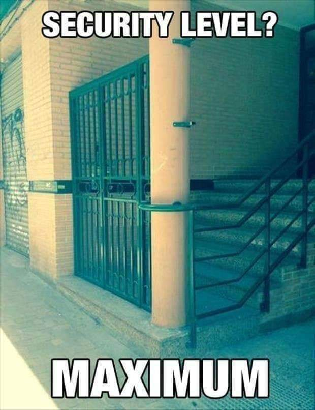
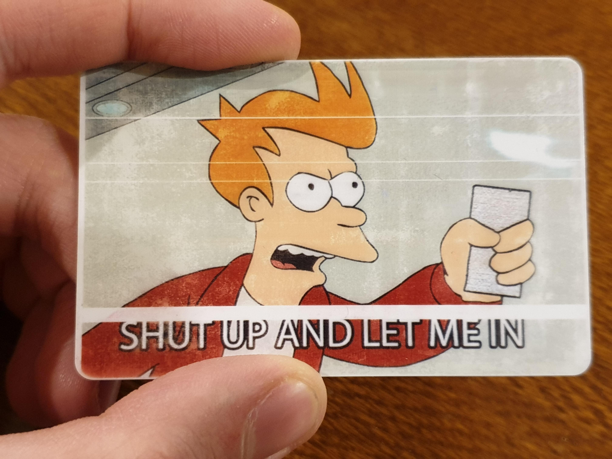

# Authorization Code Flow

> Authentication and authorization as a human

---

## Credentials (factors)

- Identifying element
  - Username
  - Phone number
- Something only you know
  - Password
- Something you have (MFA)
  - TOTP device (phone, BankID chip)
  - Hardware key

---

## Authorization code flow

- Redirects user's browser
- Endpoint: `/authentication`
- Sends:
  - Client ID
  - Callback URL
    - Configured ahead of time in tenant
  - Type of authentication (`authorization_code`)
- User logs into the login page
- Returns to client with:
  - Authorization code
  - ???

---

## Authorization code as a proof

- Proof that the user logged in
- Identifies the logged-in user

---

## Client credentials flow + authorization code

- Endpoint: `/oauth/token`
- Send:
  - Client ID
  - Client Secret
  - Authorization Code
  - Type of authentication (`authorization_code`)
- Receives:
  - Access token
  - Identity token
  - Refresh token

---

## Visualized

---

## Visualized (better)

---

## You (user) and web page (client)

---

## Auth0 (tenant)

---

## You give your credentials to Auth0

---

## Auth0 checks your credentials

---

## Credentials check out

---

## Auth0 returns Authorization code to client

---

## Client exchanges Auth code for tokens behind the scenes

---

## Heading over to the API

---

## The API you want to use (resource server)

---

## Use the access token received from Auth0

---

## You're in

